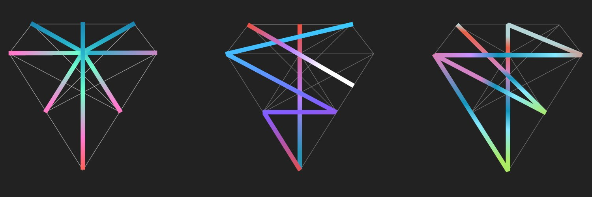

# **TON Society Grants Program**

*Draft as of 25 July 2022*

- [Introduction](#introduction) :wave:
  - [Vision](#vision)
  - [Principles](#principles)
  - [Goals](#goals)
  - [KPI](#kpi)
  - [Taxonomy](#taxonomy)
  - [Dev Support](#developer-support)

- [Funding Tiers](#funding-tiers-signal_strength) :signal_strength:
- [Process](#process--eight_spoked_asterisk) :eight_spoked_asterisk:
  - [Application](#application)
  - [Review Committee](#review-committee)
  - [Evaluation Criteria - Grants](#evaluation-criteria:-grants)
  - [Evaluation Criteria - TON Footsteps](#evaluation-criteria:-ton-footsteps)
  - [Evaluation Criteria - Sponsorships](#evaluation-criteria:-sponsorships)
  - [Evaluation Criteria - DeFi Rewards Program](#evaluation-criteria:-defi-rewards-program) 
  - [Payment](#payment)
  - [Submitting Milestone Delivery](#submitting-milestone-delivery)
  - [Post-Approval Changes in Scope](#post-approval-and-changes-in-scope)

- [Alternative Sources of Funding](#alternative-sources-of-funding-money_with_wings) :money_with_wings:
  - [Ecosystem Funds](#ecosystem-funds)
  - [Launchpad](#launchpad) 

## Introduction :wave:

First and foremost, welcome to TON Society! The three diamonds above and the unique light refractions represent the different paths teams took to arrive to the TON ecosystem. We recognize that no two paths are the same and thus aim to provide a comprehensive, yet a tailored approach to the grants program. TON Society is made up of investors and builders - and for the latter, a transparent and public way to apply, receive comments, and decision on grants is crucial. We believe GitHub is the best place to develop this initiative. We have different extensions and updates coming in the next weeks, stay in touch with us subscribing to our [Telegram Channel](https://t.me/tonsociety) and [Twitter](http://twitter.com/ton_society). And of course, any part of the Grant Program which can be improved, should be improved, so we are looking forward to hearing your feedback and suggestions. More on this below.

For more general information about TON Society, please visit our [website](https://society.ton.org/).

## Vision

**TON Grants is an ecosystem tool for driving development of TON Blockchain**.

We want Grants to be one of the entry points for the TON ecosystem. Grants are tools to support growth of [KPI](#kpi).

## Principles

1. Talents should build projects. Projects should meet capital.
2. Talent and potential before scope. We investigate teams and applications to see if we can reach a compromise with grant applicants.

## Goals

1. Providing funding for tools and projects benefiting the community.
2. Attracting talented builders to TON Ecosystem.
3. Serve as an emergency funding for builders or projects.
4. Provide endorsement and media coverage to good projects.

### Guidelines

We encourage anyone passionate about TON to apply. Our scope is broad, but projects demonstrating the following have the best chance to receive grants:

- Clear value proposition and how the grant will be used to achieve milestones which will benefit the TON ecosystem public good
- Well-researched insights and understanding of TON [architecture](https://society.ton.org/six-unique-aspects-of-ton-blockchain-that-will-surprise-solidity-developers)
- Willingness to open-source the code produced as part of the grant
- Engaging with the community and responding to comments and questions about the project
- Prior TON contest participation and evidence of successful submission
- Prior experience building or contributing to the TON ecosystem
- Social reputation on TON - evidence of engaging in developer discussions, public chats, ongoing connections to TON participants
- High opportunity cost - evidence of prior work and/or rationale for migrating to TON as the layer-1 of choice

Applications with the following characteristics will not be considered:

- Closed-sourced and grant request is mainly for funding team's current burn rate, marketing, non code production related activities 
- Projects that actively encourage gambling, illicit trade, money laundering, or criminal activities in general
- Additional applications prior to previous grant submission being completed by the same team members
- Unclear technical details (e.g. building AI-powered algorithm to assign DeFi credit score powered by TON blockchain)
- dApps and/or projects not built natively on TON

We require all projects to at a minimum provide written documentation with clear milestones. In addition, videos or demos can be submitted to increase the chance of receiving the grant. In general, we do not endorse spray & pray method of awarding grants - teams are highly encouraged to provide specific value-proposition to the TON ecosystem, in executable steps. For example:

<u>Web3 Gaming</u> 

:x: *Web3 games seeking funding for current team burn rate to develop in-game NFT module*

:white_check_mark: *Web 3 games seeking grants for development of FunC NFT smart contract for in-game milestones*   

<u>NFT</u>

:x: NFT marketing budget or NFT marketplace development funding

:white_check_mark: Specific NFT smart contract function development such as SBT, auction, etc.

### KPI

Grants are a major entry point for the TON ecosystem. Grants are tools to support the growth of:

- Userbase
- Builder community
- Total Value Locked (TVL)
- Web3 adoption use cases

### Taxonomy 

Grants will generally fit into one or more of the following categories:

1. **Recognition Grants**
   - Periodic recognition of developers making valuable contribution to the TON ecosystem (e.g. Encouraging posting of questions on forums such as Stack Overflow and answering questions therein to encourage cataloging knowledgebase). Evaluation will be on an ad-hoc basis.
2. **Community Grants**
   - Akin to subsidy - main focus is on building open-source infrastructural public-goods  
3. **T-Grants**
   - Akin to investment - main focus is on achieving ecosystem [KPIs](#kpi) 
4. **[TON Footsteps](https://github.com/ton-society/ton-footsteps)**
   - RFPs (Request for proposals) for the developer community - developers can propose and work on TON Footsteps.
5. **DeFi Rewards Program**
   - Incentive program for teams building DeFi projects which accelerates TVL
6. **Sponsorships**
   - Mainly grants for events, exhibitions, ambassador meet-ups - aims to increase userbase

### Developer Support

The grants program not only consists of funding but a way for developers and teams to receive feedback on proposals, delivered milestones, and development in general. Feedback on proposals and delivered milestones will happen through GitHub comments. Please do your best to respond to public comments in a timely manner.

As for development, best place to start is reading through official documentation and browsing the [developer blog posts](https://society.ton.org/). For *specific* technical discussions, please find the dedicated Telegram channel [here](https://t.me/tondev_eng) (@tondev_eng). If you feel that the questions are long-form in nature and other developers would benefit from referencing the dialogue in the future, we highly encourage also posting on [Stack Overflow](https://stackoverflow.com/questions/tagged/ton) (tag: ton). Your contribution to public forum discussion could also result in recognition grant and social reputation in the TON developer community. Simply put, keep the greater good of developer community in mind when interacting, rather than sole focus of getting individual questions answered.

## Funding Tiers :signal_strength:

Grants are generally considered in following tiers (note: does not pertain to DeFi Rewards Program):

### Lightning Grants (Tier 1) :zap:

- **Demographic:** Individuals, small teams
- **Amount:** Up to $5,000
- **Requirements:** [Preliminary screening](#step-1-preliminary-screening), Grant Committee lightning review & advisory approval
- **Outcome:** Application feedback, communication channel opened with Grant Committee member(s)

### Standardized (Tier 2) :airplane:

- **Demographic:** Small teams, large teams
- **Amount:** Up to $25,000
- **Requirements:** [Preliminary screening](#step-1-preliminary-screening), Grant Committee [short-form scoring](#step-2-short-form-scoring), [call with the team](#step-3-call-with-the-team), and advisors' buy-in
- **Outcome:** All of the above, introduction to related teams/projects/communities, Ecosystem Fund introduction (as needed)  

### Standardized (Tier 3) :rocket:

- **Demographic:** Large teams, teams with proven track record on TON or other ecosystems
- **Amount:** Up to $100,000
- **Requirements:** [Preliminary screening](#step-1-preliminary-screening), Grant Committee [long-form scoring](#step-25-long-form-scoring), [call with the team](#step-3-call-with-the-team), and advisors' recommendation
- **Outcome:** All of the above, introduction to related teams/projects/communities, Ecosystem Fund introduction (as needed)

## Process  :eight_spoked_asterisk:

### Application

Current process for applying is to visit the grants section of the [website](https://ton.org/grants) and opting for either [Typeform](https://ton-org.typeform.com/funding) or [Telegram bot](https://t.me/TONfunding_bot). As part of the application, the following [template](https://telegra.ph/TON-Project-Proposal-Template-05-12) should be filled out as comprehensively as possible. Applications will be reviewed on a rolling basis. GitHub grantee section will be updated with accepted grantees on an ongoing basis, but official announcements with stats will be announced on a quarterly basis via TON Society blog post. 

In the near future, we will update this process and institute an open-application via GitHub submission (fork and pull request). This will allow for public comment period and chance for the founding team to address any questions and concerns from the community. However, current process will still be available for team willing to test their applications with Grants Team.

*[Coming soon]*

### Review Committee

The following people make up the review committee:

**Grant Committee**

- [Justin Hyun](https://github.com/tonkongz)
- Dasha Vasilieva
- Lisa Ferdman - Sponsorship evaluator

**Technical Advisors**

- Dr. Elias
- [Tal Kol](https://github.com/talkol)
- Anatoliy Makosov
- Kirill Emelyanenko
- Narek Abovyan

**Business Advisors**

- Andrew Rogozov
- Steve Yun

### Evaluation Criteria: Grants

**Community Grants & T-Grants**

##### Step 0:

|                      | ***open-source***                      | ***closed-source***                    |
| -------------------- | -------------------------------------- | -------------------------------------- |
| ***not-for-profit*** | Community Grant (1) :white_check_mark: | Community Grant (3) :white_check_mark: |
| ***for-profit***     | T-Grant (2) :white_check_mark:         | Ecosystem Fund / IDO candidate :x:     |

(1) For public good (e.g., contract executor, smart contract tools, low-code solutions)

(2) For-profit but open-source (e.g., multi-chain bridge)

(3) Not-for-profit but closed-source (e.g., certain teams that want exclusive use of in-house tools)

(4) Ecosystem Fund or Launchpad candidate

*Note: While the above criteria is considered for filtering purposes, the grant committee ultimately has the discretion to accept applications based on the evaluation of overall benefit to the TON community. For example, projects with highly promising application with major contribution to KPI could be awarded certain grants despite the for-profit and closed-source structure.*

##### Step 1: Preliminary screening

Initial set of questions considered in a yes/no format: 

1. Missing strategic fit?
2. Project does not lead to TON adoption
3. Project does not seek a global market
4. Bad reputation of the founder/project team
5. The founders have a conflict of interest
6. The grant committee has a conflict of interest
7. Potential scam/unclear use of funds
8. Stakeholders are non-compliant
9. Is the project for-profit and closed-source?

##### Step 2: Short-form scoring 

|                                              | 1 (Low-Rank)                                                 | 2                                                            | 3                                                            | 4                                                            | 5 (High-Rank)                                                |
| -------------------------------------------- | ------------------------------------------------------------ | ------------------------------------------------------------ | ------------------------------------------------------------ | ------------------------------------------------------------ | ------------------------------------------------------------ |
| Minimum Viable Team (project size dependent) | - There is a clear miss match between project scope and team size                                                 - Team is a collective of founder(s) inner-circle without consideration of abilities | - There are some miss match between project scope and team size                                                 - Team was assembled with consideration of abilities but shallow level of collective experience | - Project scope and team size are generally a match                                 - Team was assembled with consideration of abilities, and certain team members have industry experience | - Project scope and team size are right-sized                                    - Team was assembled with deep consideration of abilities, and most team members have industry experience | - Project scope and team size are optimized                                                     - Team was assembled with deep consideration of abilities, and combined team members’ industry experience is second-to-none |
| Product/project readiness?                   | - No proof-of-concept                   - Lack of clarity in product/project roadmap | - Proof-of-concept available          - General product/project roadmap | - Proof-of-concept available                 - Clear and actional product/project roadmap | - MVP available                            - Product/project test market proven (some usage by the open-source community) | - MVP available and demonstrated track-record of updates and improvements to the MVP                                 - Product/project market proven (e.g., number of saves in Github) |
| Appropriate market analysis                  | - The founder(s) have limited to no peer-analysis knowledge  | - The founder(s) have some peer-analysis knowledge, but only on a high-level (i.e., lack of metrics) | - The founder(s) have good peer-analysis knowledge on a detailed level (i.e., appropriate benchmarks, metrics) | - The founder(s) have extensive peer-analysis knowledge on a detailed level                                - Founder(s) have experience working in other projects/teams in the peer-group | - The founder(s) have deep knowledge of the industry and its peers                  - The founders are thought-leaders and experts in their fields (e.g., subject matter experts) |

##### Step 2.5: Long-form scoring

All of the above & the below questions

|                                                | 1 (Low-Rank)                                                 | 2                                                            | 3                                                            | 4                                                            | 5 (High-Rank)                                                |
| ---------------------------------------------- | ------------------------------------------------------------ | ------------------------------------------------------------ | ------------------------------------------------------------ | ------------------------------------------------------------ | ------------------------------------------------------------ |
| Blockchain/IT team alongside the founder?      | - Founder does not have a blockchain/IT team (solo) and no prior experience building a team | - Founder does not have a blockchain/IT team (solo) but some prior experience building a team | - Founder has a blockchain/IT team but no prior experience building a team | - Founder has a blockchain/IT team and prior experience building a team | - Founder has a veteran blockchain/IT team (worked together previously) with a proven track record of past success |
| Any other working blockchains/dApps currently? | - Team does not have any other working blockchain/dApps currently nor created one in the past | - Team does not have any other working blockchain/dApps currently but has created ones in the past | - Team has one working blockchain/dApp currently             | - Team has many working blockchain/dApp currently            | - Team has many working blockchain/dApp currently widely used by the community |
| Any prior contest/community results?           | - No participation or N/A                                    | - Present in Telegram chats/participated in contest(s) with no results | - Participated in contest(s) submitting work, but provided little to no valid input                                                      - Present in chats, but is not involved in meaningful/valuable discussions | - Participated in contest(s) scoring in the top 25%                 - Active member of TON developer discussions | - Participated in contest(s) scoring in the top 10%                                           - Active contributor to TON developer discussions |
| Tech stack                                     | - No experience with blockchain or no prior contribution to open-source repositories | - Tech team without experience with TON blockchain but with experience in other blockchains (no experience on full-stack) | - Limited experience in building on TON                                                       - Team has working contracts on the mainnet. The team has experience with full-stack development. | - Team has functioning contracts on the mainnet, but the contracts might not be very useful nor widely used                                  - Team has extensive experience with full-stack development | - Team has contributed to production code, which works in critical projects of the ecosystem or market leaders           - Team also has a proven track record of full-stack development |
| Does the founder have relevant expertise?      | - Founder has no prior experience in tech                    | - Founder has prior experience in tech but not in blockchain | - Founder has prior experience in blockchain                 | - Founder has prior experience in blockchain and successfully launched projects | - Founder has prior experience in blockchain and successfully launched projects with wide-adoption |
| Community potential                            | - Project will not draw in any existing TON community        | - Project will draw in some existing TON community           | - Project will draw in most existing TON communities         | - Project will draw in most existing TON communities and some peer communities | - Project will draw in most existing TON communities and most peer communities |

##### Step 3: Call between Grant Committee and team

### Evaluation Criteria: TON Footsteps 

Refer to the TON Footsteps [README](https://github.com/ton-society/ton-footsteps/blob/main/README.md)

### Evaluation Criteria: Sponsorships

##### Step 1: Preliminary screening

Initial set of questions considered in a yes/no format: 

1. Missing strategic fit?
2. Project does not lead to TON adoption
3. Project does not seek a global market
4. Bad reputation of the founder/project team
5. The founders have a conflict of interest
6. The grant committee has a conflict of interest
7. Potential scam/unclear use of funds
8. Stakeholders are non-compliant

##### **Step 2: Scoring**

|                       | 1 (Low-Rank)                                                 | 2                                                            | 3                                                            | 4                                                            | 5 (High-Rank)                                                |
| --------------------- | ------------------------------------------------------------ | ------------------------------------------------------------ | ------------------------------------------------------------ | ------------------------------------------------------------ | ------------------------------------------------------------ |
| Team experience       | - Team has no experience organizing developer/community events | - Team has limited experience organizing developer/community events | - Team has experience organizing developer/community events varying in size | - Team has extensive experience organizing developer/community events varying in size                   - Events received positive feedback and some press coverage | - Team is an industry leader in organizing developer/community events varying in size                             - Events were high-profile in nature and received extensive press coverage |
| Event potential       | - Event will not draw in any existing TON community                - Highly restricted in location (lack of focus on international community), and no plan for asynchronous distribution to online attendees/followers | - Event will draw in some existing TON communities                          - Restricted in location but planned for asynchronous content distribution to online attendees/followers | - Event will draw in most existing TON communities                                         - Ideal location (easy to travel to and little border restrictions) and planned for asynchronous content distribution to online attendees/followers | - Event will draw in most existing TON communities, and some peer communities                                - Ideal location (easy to travel to and little border restrictions) and planned for live-streaming to online attendees/followers | - Event will draw in most existing TON communities, and most peer communities                                          - Ideal location (easy to travel to and little border restrictions) and planned for live interaction with online attendees/followers |
| Post-event potential  | - Lack of post-event engagement and community follow-up plan (i.e., one-and-done) | - Some plan for post-event engagement and community follow-up | - Extensive plan for post-event engagement and community follow-up | - Extensive plan for post-event engagement and community follow-up                                      - Events are organized as series | - Extensive plan for post-event engagement and community follow-up - Events are organized as series- High potential for post-event peer community engagement on TON |
| Level of independence | - Team has no experience with the TON community and requires guides/content from TON Foundation | - Team has limited experience with the TON community and requires guides/content from TON Foundation | - Team has experience with the TON community and self-sufficiently prepares event materials for review by the TON Foundation | - Team has extensive experience with the TON community and prepares materials which can serve as a future resource for the community | - Team is a leader in the TON community and prepares materials which can serve as a future resource for the community                                       - Independently sources reputable speakers/panellists |

##### **Step 3: Call between Head of Events and team**

### Evaluation Criteria: DeFi Rewards Program

See [here](https://github.com/ton-society/Grants-Program/blob/main/Announcements/DeFi%20Rewards%20Program.md)

### Payment

Teams should include their TON wallet address in the application. Grants will be paid out in [Toncoin](https://coinmarketcap.com/currencies/toncoin/) and FX at the discretion of the Grant Committee will be used (e.g., average 30-days rolling or spot). While the Grant Committee meets on a weekly basis, depending on the backlog of applications and advisors' review queue, there could be delays in final decision and/or payment. We will communicate proactively with the team.

### Submitting Milestone Delivery

*[Coming soon]* 

### Post-Approval and Changes in Scope

We understand that there can be unanticipated changes due to internal/external reasons. In such events, please see below:

- Significant deviation from the original *scope* requires proactive communication with the Grant Committee and appropriate explanation. Based on the nature of the change, we will recommend a new application/pull-request so that the community will have an opportunity to opine.
- Significant deviation from the original *delivery timeline* requires proactive communication with the Grant Committee and appropriate explanation. Failure to communicate can result in termination of the grant and consideration for remaining milestones.

## Alternative Sources of Funding :money_with_wings:

### Ecosystem Funds

- [TONcoin Fund](https://www.toncoin.fund/)
- [TAV Fund](https://tav-incubation.com/)

### Launchpad

- [Tonstarter](https://tonstarter.com/)
